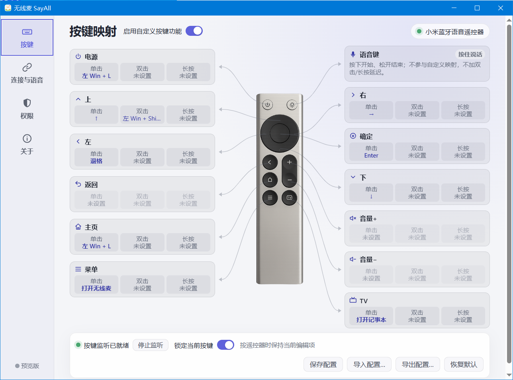
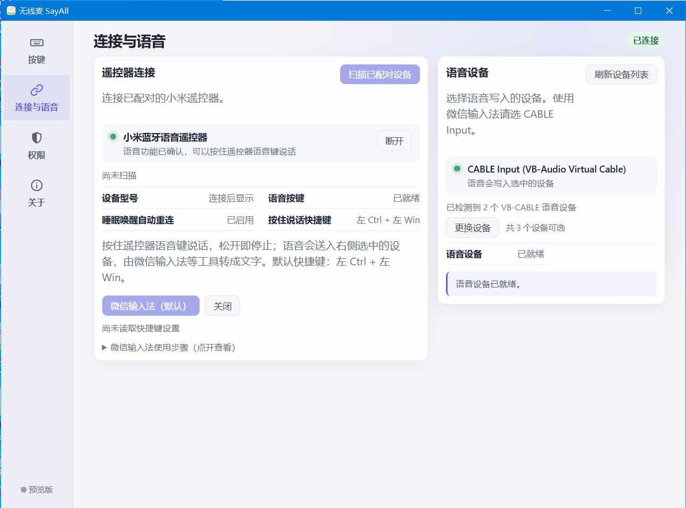

# 无线麦 SayAll for Windows

<p align="center">
  
</p>

<p align="center">小米蓝牙遥控器的可视化按键映射</p>

<table>
  <tr>
    <td align="center">
      <br>
      <strong>Windows 用户交流群</strong><br>
      微信扫码加入交流群
    </td>
    <td align="center">
      <a href="Screenshots/xhs-sayall.jpg"></a><br>
      <strong>小红书</strong><br>
      扫码关注无线麦
    </td>
  </tr>
</table>

## 视频介绍

《可能是我最近用过最不像工具的工具》展示了无线麦如何把蓝牙语音遥控器变成随手表达、控制电脑和与 AI 协作的新入口。视频中的产品界面以当时展示版本为准。

<p align="center">
  <a href="https://www.bilibili.com/video/BV13Pep6BEXe">
    
  </a>
</p>

<p align="center"><a href="https://www.bilibili.com/video/BV13Pep6BEXe">点击封面或前往 Bilibili 观看原视频</a></p>

视频作者：[可乐不甜的跑焦日记](https://space.bilibili.com/327214328)

无线麦 SayAll Windows 版支持目标为小米蓝牙遥控器 2（RC001）和 2 Pro（RC003）。当前分支的实际通过范围见 [能力与验证边界](docs/FEATURES.md)，上游历史真机结果不能代替本地整合候选验收。项目采用 Rust、Tauri 2 和 Vue 3，Windows 与 macOS 分别维护和发布。

参考源码仓库：[HD838A/remote-mic-app](https://github.com/HD838A/remote-mic-app)（macOS 版）。Windows 版保持独立的平台实现，仅参考其公开的产品行为、协议经验和测试边界，不回填 macOS 代码。

当前仓库处于新架构开发阶段。现阶段已经建立：

- Mac 原版风格的设置界面骨架；
- ATVV、IMA/DVI ADPCM 和语音会话纯 Rust 核心；
- WinRT 已配对设备扫描、标准 GATT Model Number（2A24）型号识别、连接/通知/释放和 RC001/RC003 到 PCM 的会话管线；
- 用户明确选择端点的 WASAPI 共享模式输出、有界 PCM 队列和 padding 排空；
- 以稳定 endpoint ID 和名称持久化用户选择，启动时只恢复身份完全一致的端点；
- 记住用户明确选择的 RC001 或 RC003，并以 2–30 秒指数退避自动重连；Windows 睡眠时主动释放会话，恢复后重建 GATT/ATVV；
- 可区分连接、特征发现、能力确认、就绪、流式接收、排空、断开和失败的真实状态界面；
- 设备路径限定的 Raw Input、批量 SendInput、映射持久化与显式快捷键测试；
- 仅保存在本机的每日按键、完整语音会话和语音时长统计，以及今日、本周、全部和最近 7 天展示；
- Windows 10 1809（build 17763）安装与启动双层版本门禁；
- 可见安装完成后的 VB-CABLE 缺失提示、官方下载入口，以及首次启动时唯一 CABLE Input 的自动检测和配置；
- Windows CI 可生成带 SHA-256 和来源元数据的未签名 NSIS Preview artifact；
- Windows CI、来源归属和真机测试手册。

本地 RC003 的来源、映射、键盘并用与部分生命周期已有分项实证；新候选受影响场景仍需本机验收，RC001 无当前实机时保持 `deferred`。语音、安装器、VB-CABLE 和第三方输入法按测试手册分项记录。公开发布目前仍处于预览阶段，更新包包含 updater minisign 签名，但尚无 Authenticode 代码签名，首次运行可能触发 SmartScreen 提示。

本次上游整合新增可选电量显示、通用配置的鼠标点击/移动/滚轮、系统级快捷键录入和 Windows 应用库。它们不改变已有默认绑定；完整模板仍为固定键/组合键，不扫描第三方窗口内容。按键页编辑后显式保存，已安装应用库不写入可分享的配置导出。合并候选验证状态见 TODO。

## 用户安装与配置

首次安装、遥控器配对、VB-CABLE、语音输入软件、按键映射、更新和排障步骤见 [安装与配置指南](docs/installation-and-configuration.md)。文档同时给出了 AI Agent 的安全执行边界与可验证的完成标准。

<p align="center">
  
</p>

<p align="center">连接遥控器并选择语音写入设备</p>

## 技术结构

```text
Vue 3 UI
   ↓ Tauri IPC
Tauri App Host
   ↓
sayall-core       ATVV、ADPCM、会话、配置、统计
sayall-windows    WinRT BLE、Raw Input、SendInput、WASAPI
```

详细方案见 [Windows Tauri 长期架构与实施路线](docs/architecture/windows-tauri-roadmap.md)。

## 开发环境

- Windows 10 1809 或更高版本，x64；
- Rust stable；
- Node.js 22 或更高版本；
- pnpm 9 或更高版本；
- Visual Studio Build Tools，包含“使用 C++ 的桌面开发”；
- WebView2 Runtime。

Mac 可以运行前端构建和纯 Rust 测试，但不能证明 WinRT BLE、Raw Input、WASAPI、安装器版本提示或 RC001/RC003 真机行为。
当前平台层已通过 `x86_64-pc-windows-msvc` 交叉静态检查；这只能证明 WinRT、WASAPI API 符号和类型可编译，Windows 运行时、VB-CABLE 回环与 RC001/RC003 真机结果仍以 Windows CI 和测试手册为准。

## 本地检查

```bash
# 一键前置自检（首次需构建 Helper 并获取散列锁定的 Gadget）
powershell -ExecutionPolicy Bypass -File scripts\ci-preflight.ps1

# 或分步执行：
pnpm install
pnpm test
pnpm build
node scripts/stage-bundle-inputs.cjs
cargo test --workspace
cargo test --locked --manifest-path hardware/RC003/helper/Cargo.toml
node hardware/RC003/helper/agent/agent_logic_test.mjs
cargo fmt --all -- --check
```

发布前深度自检：`ci-preflight.ps1 -Full`（追加 runtime-simulation 构建）。纯文档/非功能改动（**.md、docs/、Testing/、artifacts/）不触发 CI。完整提交纪律见 [BRANCH_MANAGEMENT.md](BRANCH_MANAGEMENT.md)。

治理与交付规范： [日志规范](LOGGING.md) · [Windows 发布流程](RELEASING.md) · [技术边界](TECHNICAL.md) · [排障指南](TROUBLESHOOTING.md) · [Bug 记录规范](Bugs/README.md) · [发布生命周期测试](Testing/WindowsReleaseBranchLifecycle.md)。

Windows 主机上的完整检查和双型号真机步骤见 [Testing/WindowsRC003Preview.md](Testing/WindowsRC003Preview.md)。

## 开源协议

程序代码使用 GPL-3.0-only。App Logo 和 App Icon 是保留版权的专有品牌资产，不属于 GPL-3.0-only 授权范围；详见 [LOGO-LICENSE.md](LOGO-LICENSE.md)。第三方来源与素材边界见 [ATTRIBUTION.md](ATTRIBUTION.md) 和 [THIRD_PARTY_NOTICES.md](THIRD_PARTY_NOTICES.md)。
