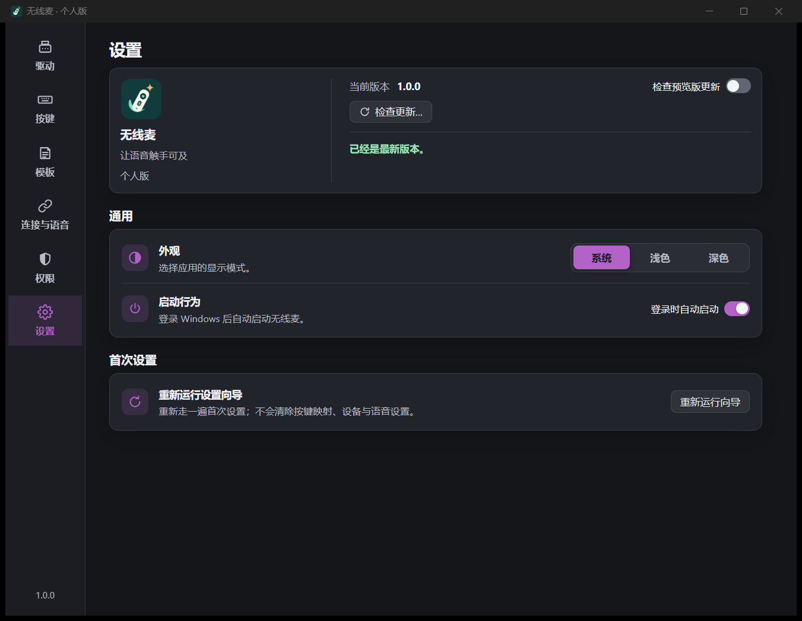

# 无线麦 Windows 个人版

本个人版由 luck-gh 修改；个人版改造始于 2026-10-06。基于上游 GPL-3.0-only Windows 项目，原版权保留；来源与素材归属见 [ATTRIBUTION.md](ATTRIBUTION.md)。

<p align="center">
  
</p>

<p align="center">小米蓝牙遥控器的可视化按键映射</p>

[个人版仓库](https://github.com/luck-gh/remote-mic-app-windows) · [版本与下载](https://github.com/luck-gh/remote-mic-app-windows/releases) · [问题反馈](https://github.com/luck-gh/remote-mic-app-windows/issues)

无线麦 Windows 个人版支持目标为小米蓝牙遥控器 2（RC001）和 2 Pro（RC003）。当前分支的实际通过范围见 [能力与验证边界](docs/FEATURES.md)，上游历史真机结果不能代替本地整合候选验收。项目采用 Rust、Tauri 2 和 Vue 3，Windows 与 macOS 分别维护和发布。

支持目标包括两种型号；各型号的当前验收结果以本 fork 的测试记录为准：

- 小米蓝牙遥控器 2（RC001）
- 小米蓝牙遥控器 2 Pro（RC003）

## 主要功能

本地 RC003 的来源、映射、键盘并用与部分生命周期已有分项实证；新候选受影响场景仍需本机验收，RC001 无当前实机时保持 `deferred`。语音、安装器、VB-CABLE 和第三方输入法按测试手册分项记录。个人版更新使用独立的 updater minisign 签名，尚无 Authenticode 代码签名，首次运行可能触发 SmartScreen 提示。签名和实际发布状态以个人版交付记录及 Releases 为准。

本次上游整合新增可选电量显示、通用配置的鼠标点击/移动/滚轮、系统级快捷键录入和 Windows 应用库。它们不改变已有默认绑定；完整模板仍为固定键/组合键，不扫描第三方窗口内容。按键页编辑后显式保存，已安装应用库不写入可分享的配置导出。合并候选验证状态见 TODO。

## 用户安装与配置

下载入口仅使用[个人版 Releases](https://github.com/luck-gh/remote-mic-app-windows/releases)。若尚无可用发行包，使用维护者提供的本地测试包，不改用上游安装包。

首次安装、遥控器配对、语音软件设置、按键映射、更新和排障步骤，见 [安装与配置指南](docs/installation-and-configuration.md)。版本更新内容随个人版 Releases 提供。

当前个人版设置界面（1.0.0，2026-10-16 安装版实拍）：



截图展示版本与外观；功能实际通过范围仍见 [能力与验证边界](docs/FEATURES.md)。

## 参与开发

```text
Vue 3 UI
   ↓ Tauri IPC
Tauri App Host
   ↓
sayall-core       ATVV、ADPCM、会话、配置、统计
sayall-windows    WinRT BLE、Raw Input、SendInput、WASAPI
```

详细方案见 [Windows Tauri 长期架构与实施路线](docs/architecture/windows-tauri-roadmap.md)。

## 开发环境

- Windows 10 1809 或更高版本，x64；
- Rust stable；
- Node.js 22 或更高版本；
- pnpm 9 或更高版本；
- Visual Studio Build Tools，包含“使用 C++ 的桌面开发”；
- WebView2 Runtime。

Mac 可以运行前端构建和纯 Rust 测试，但不能证明 WinRT BLE、Raw Input、WASAPI、安装器版本提示或 RC001/RC003 真机行为。
当前平台层已通过 `x86_64-pc-windows-msvc` 交叉静态检查；这只能证明 WinRT、WASAPI API 符号和类型可编译，Windows 运行时、VB-CABLE 回环与 RC001/RC003 真机结果仍以 Windows CI 和测试手册为准。

## 本地检查

```bash
# 一键前置自检（首次需构建 Helper 并获取散列锁定的 Gadget）
powershell -ExecutionPolicy Bypass -File scripts\ci-preflight.ps1

# 或分步执行：
pnpm install
pnpm test
pnpm build
node scripts/stage-bundle-inputs.cjs
cargo test --workspace
cargo test --locked --manifest-path hardware/RC003/helper/Cargo.toml
node hardware/RC003/helper/agent/agent_logic_test.mjs
cargo fmt --all -- --check
```

发布前深度自检：`ci-preflight.ps1 -Full`（追加 runtime-simulation 构建）。纯文档/非功能改动（**.md、docs/、Testing/、artifacts/）不触发 CI。完整提交纪律见 [BRANCH_MANAGEMENT.md](BRANCH_MANAGEMENT.md)。

治理与交付规范： [日志规范](LOGGING.md) · [Windows 发布流程](RELEASING.md) · [技术边界](TECHNICAL.md) · [排障指南](TROUBLESHOOTING.md) · [Bug 记录规范](Bugs/README.md) · [发布生命周期测试](Testing/WindowsReleaseBranchLifecycle.md)。

Windows 主机上的完整检查和双型号真机步骤见 [Testing/WindowsRC003Preview.md](Testing/WindowsRC003Preview.md)。

上游新增开发指南见 [DEVELOPMENT.md](DEVELOPMENT.md)，本地验证边界仍以上述文档为准。

## 开源协议

程序代码使用 GPL-3.0-only。上游原 App Logo 和 App Icon 是保留版权的专有品牌资产，不属于 GPL-3.0-only 授权范围；本个人版运行资产已替换为独立“轻放”设计，历史 icon-source.png 仅供取证，不用于运行；详见 [LOGO-LICENSE.md](LOGO-LICENSE.md)。第三方来源与素材边界见 [ATTRIBUTION.md](ATTRIBUTION.md) 和 [THIRD_PARTY_NOTICES.md](THIRD_PARTY_NOTICES.md)。
